### Hai, I'm [Liondy][website] 👋

## DevOps / SRE Engineer | AI Engineer Automation | Cybersecurity ✌

- I'm a student from Indonesia who loves learning by doing
- I'm an enthusiastic person who loves about new things, willing to learn on their own

### Connect with me

[][website] [][linkedin] [][gitlab]

### Languages and Tools that I use:

 
 
 

 
 
 
 
 
 
 

  

---

---

[website]: https://liondy.com
[linkedin]: https://www.linkedin.com/in/michael-liondy/
[gitlab]: https://gitlab.com/liondy/
